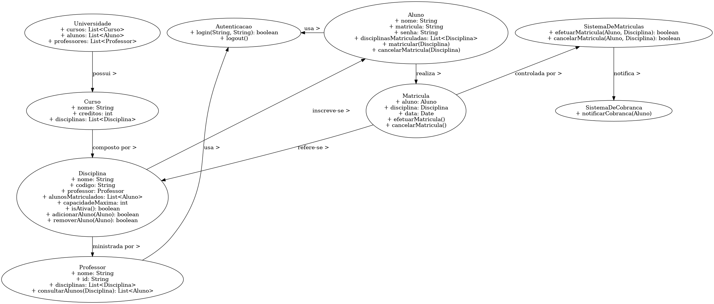

# Sistema de Matrículas

## 📌 Sobre o Projeto
O **Sistema de Matrículas** é uma aplicação desenvolvida para informatizar o processo de matrículas de uma universidade. O sistema permite que alunos se matriculem em disciplinas, professores consultem suas turmas e a administração gere relatórios sobre os cursos oferecidos. Além disso, integra-se com um sistema de cobranças para processamento de pagamentos dos alunos.

**Desenvolvido por:** Marcelo Matos  
**Matrícula:** 689916  

## 📂 Estrutura de Pastas
Abaixo está a estrutura do repositório para facilitar a compreensão e manutenção do projeto:

```
PROJETO-SOFTWARE-SPRINT2/
│── docs/
│   ├── diagramas/
│   │   ├── sistema_matriculas.png  <- Diagrama UML do sistema
│── src/
│   ├── main/
│   │   ├── java/
│   │   │   ├── br/
│   │   │   │   ├── controller/
│   │   │   │   │   ├── AlunoController.java
│   │   │   │   │   ├── MatriculaController.java
│   │   │   │   │   ├── ProfessorController.java
│   │   │   │   ├── model/
│   │   │   │   │   ├── Aluno.java
│   │   │   │   │   ├── Autenticacao.java
│   │   │   │   │   ├── Curso.java
│   │   │   │   │   ├── Disciplina.java
│   │   │   │   │   ├── Matricula.java
│   │   │   │   │   ├── Professor.java
│   │   │   │   │   ├── SistemaDeMatriculas.java
│   │   │   │   │   ├── SistemaDeCobranca.java
│   │   │   │   │   ├── Universidade.java
│   │   │   │   ├── repository/
│   │   │   │   │   ├── AlunoRepository.java
│   │   │   │   │   ├── CursoRepository.java
│   │   │   │   │   ├── DisciplinaRepository.java
│   │   │   │   │   ├── ProfessorRepository.java
│   │   │   │   ├── service/
│   │   │   │   │   ├── AutenticacaoService.java
│   │   │   │   │   ├── CobrancaService.java
│   │   │   │   │   ├── MatriculaService.java
│   ├── resources/
│   │   ├── application.properties
│   ├── test/
│   │   ├── java/
│   │   │   ├── br/
│   │   │   │   ├── universidade/
│   │   │   │   │   ├── matriculas/
│   │   │   │   │   │   ├── SistemaDeMatriculasTest.java
│── .gitignore
│── README.md
```

## 🏗️ Funcionalidades do Sistema
✅ Gerenciamento de matrículas em disciplinas  
✅ Controle de alunos e professores  
✅ Definição de cursos e disciplinas  
✅ Integração com sistema de cobranças  
✅ Regras para ativação/cancelamento de disciplinas  

## 📝 Diagrama UML
O seguinte diagrama representa a estrutura do Sistema de Matrículas:

